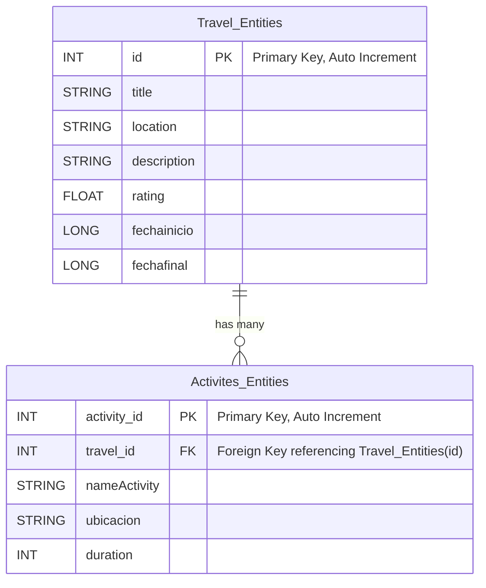

📌 Funcionalidades añadidas:

Implementación de stringResource: Ahora todos los textos visibles en la interfaz se obtienen de los archivos de recursos (strings.xml), facilitando la internacionalización y el soporte multilingüe (español, inglés y catalán).

Optimización del ViewModel: Se ha mejorado la lógica de gestión de datos de la lista de viajes (travelItems) para asegurar un flujo de datos más reactivo y eficiente utilizando StateFlow.

Refactorización del código: Se ha reorganizado y limpiado el código para mejorar la legibilidad, modularidad y facilitar el mantenimiento.

Mejora de la pantalla Home: Se han reestructurado los botones de acción (Agregar, Guardar, Cancelar) para que sean más intuitivos, adaptables y accesibles visualmente.

Persistencia tras rotación de pantalla: Se ha gestionado correctamente el estado de los elementos (lista de viajes, idioma seleccionado, etc.) para que no se pierda al rotar el dispositivo.

Implementación de logs: Se han incorporado Log.i y Log.e para facilitar la depuración y seguimiento del comportamiento de la app en eventos clave: inicio de sesión, errores, cambio de idioma, adición/eliminación de viajes.

Inyección de dependencias usando Hilt: Se ha incorporado Hilt para una gestión eficiente y escalable de las dependencias del proyecto.

✅ Descripción de los Tests del TravelListViewModel:

Los tests unitarios aseguran que el comportamiento del TravelListViewModel sea correcto. 
A continuación, se describe el propósito de cada uno:

addTravelItem adds a new item
Verifica que al agregar un nuevo viaje, este se añada correctamente a la lista del ViewModel.

deleteTravelItem removes the item
Comprueba que un viaje añadido se puede eliminar correctamente de la lista.

updateTravelItem modifies existing item
Asegura que si se actualiza un viaje (por ejemplo, cambiando el título), ese cambio se refleje correctamente en la lista.

addActivityToTravel adds activity correctly
Evalúa que al agregar una actividad a un viaje, esta se añada correctamente dentro del viaje correspondiente.

removeActivityFromTravel removes activity correctly
Comprueba que se puede eliminar correctamente una actividad específica de un viaje.

updateActivityInTravel updates an activity correctly
Valida que una actividad dentro de un viaje puede ser actualizada correctamente (por ejemplo, modificando la duración).

startEditing and stopEditing change editingItemId correctly
Asegura que al iniciar o finalizar la edición de un viaje, el estado editingItemId del ViewModel se actualice correctamente.

### Resultados de los tests unitarios

Se han ejecutado un total de 7 tests unitarios sobre el `TravelListViewModel`. Todos los tests se han completado satisfactoriamente, validando la lógica de gestión de datos de la lista de viajes y actividades.

| Test                                                   | Resultado   |
|--------------------------------------------------------|-------------|
| addTravelItem adds a new item                          | ✅ Correcto |
| deleteTravelItem removes the item                      | ✅ Correcto |
| updateTravelItem modifies existing item                | ✅ Correcto |
| addActivityToTravel adds activity correctly            | ✅ Correcto |
| removeActivityFromTravel removes activity correctly    | ✅ Correcto |
| updateActivityInTravel updates an activity correctly   | ✅ Correcto |
| startEditing and stopEditing change editingItemId      | ✅ Correcto |

# Sprint3 Database

Nuestra base de datos está diseñada para gestionar información relacionada con viajes y sus respectivas actividades. Se compone de dos entidades principales: `Travel_Entities` y `Activites_Entities`, que están relacionadas entre sí para mantener una estructura organizada y funcional.

## Estructura de la Base de Datos

### Travel_Entities
La entidad `Travel_Entities` almacena información sobre cada viaje, incluyendo:
- **ID**: Identificador único del viaje.
- **Título**: Nombre del viaje.
- **Ubicación**: Lugar donde se desarrolla el viaje.
- **Descripción**: Breve resumen del viaje.
- **Valoración**: Puntuación asignada al viaje.
- **Fecha de inicio**: Momento en que comienza el viaje.
- **Fecha de finalización**: Momento en que termina el viaje.
Nota: Se ha cambiado el campo duration por fechainicio y fechafinal en Travel_Entities.
### Activites_Entities
La entidad `Activites_Entities` contiene información sobre las actividades relacionadas con un viaje específico, incluyendo:
- **ID de actividad**: Identificador único de la actividad.
- **ID de viaje**: Referencia al viaje al que pertenece la actividad.
- **Nombre de la actividad**: Título de la actividad.
- **Ubicación**: Lugar donde se lleva a cabo la actividad.
- **Duración**: Tiempo estimado de la actividad.

## Relación entre Entidades
Cada viaje puede contener múltiples actividades, estableciendo una relación uno a muchos entre `Travel_Entities` y `Activites_Entities`. Esta relación permite organizar de manera eficiente las actividades dentro de cada viaje y facilita su administración dentro de la base de datos.

## Diagrama de la Base de Datos

##Cambios
Nuevos campos en actividad: Ya no existe el campo Duración sino los campos fechaInicio y fechaFinal.

