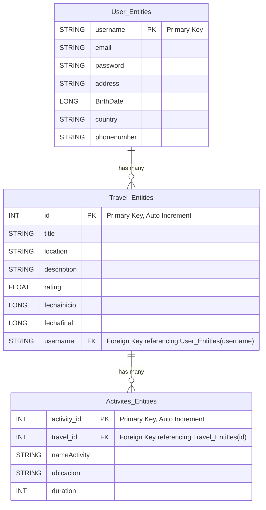

```mermaid
classDiagram
    class Usuario {
        +String nombre
        +String correo_e
        +String constraseña
        +void crearUsuario()
        +void eliminarUsuario()
    }

    class Login {
	    +String nombreUsuario
	    +String contraseña
	    +void login(nombreUsuario:String, contraseña:String)
	    +void logout()
	    +void resetContraseña(nombreUsuario:String)
    }

    class Preferencias {
	    +String tema
	    +String lenguje
	    +String userId
	    +Boolean notificaciones
	    +void cambiarTema()
	    +void habilitarNotificaciones()
	    +void deshabilitarNotificaciones()
	    +void cambiarLenguaje()
    }

    class Viaje {
	    +Date diaInicio
	    +Date diaFinal
        +Int numeroParadas
	    +void empezarViaje(diaIncio:Date, diaFinal:Date)
    }

    class Mapa {
	    +void mostrarLocalizacion()
	    +void sitiosCercanos()
        +void mostarPunto()
    }
    class PuntoIntinerario{
        +Mapa puntoIntinerario
        +void mostratPunto()
        +void establecerPunto()
    }
    class Recomendaciones{
        +Mapa recomendacion
        +void tenerRecomendacion()
    }

    Usuario "1" -- "1" Preferencias : has
    Usuario "1" -- "1" Login : manages
    Usuario "1" -- "*" Viaje : owns
    Viaje "*" -- "1" Mapa : shows locations
    Viaje "1" -- "*" PuntoIntinerario : contains
    Viaje "*" -- "*" Recomendaciones : gets
'''
# Sprint3 Database

Nuestra base de datos está diseñada para gestionar información relacionada con viajes y sus respectivas actividades. Se compone de dos entidades principales: `Travel_Entities` y `Activites_Entities`, que están relacionadas entre sí para mantener una estructura organizada y funcional.

## Estructura de la Base de Datos

### Travel_Entities
La entidad `Travel_Entities` almacena información sobre cada viaje, incluyendo:
- **ID**: Identificador único del viaje.
- **Título**: Nombre del viaje.
- **Ubicación**: Lugar donde se desarrolla el viaje.
- **Descripción**: Breve resumen del viaje.
- **Valoración**: Puntuación asignada al viaje.
- **Fecha de inicio**: Momento en que comienza el viaje.
- **Fecha de finalización**: Momento en que termina el viaje.
Nota: Se ha cambiado el campo duration por fechainicio y fechafinal en Travel_Entities.
### Activites_Entities
La entidad `Activites_Entities` contiene información sobre las actividades relacionadas con un viaje específico, incluyendo:
- **ID de actividad**: Identificador único de la actividad.
- **ID de viaje**: Referencia al viaje al que pertenece la actividad.
- **Nombre de la actividad**: Título de la actividad.
- **Ubicación**: Lugar donde se lleva a cabo la actividad.
- **Duración**: Tiempo estimado de la actividad.

## Relación entre Entidades
Cada viaje puede contener múltiples actividades, estableciendo una relación uno a muchos entre `Travel_Entities` y `Activites_Entities`. Esta relación permite organizar de manera eficiente las actividades dentro de cada viaje y facilita su administración dentro de la base de datos.

## Diagrama de la Base de Datos
```mermaid
erDiagram
    Travel_Entities {
        INT id PK "Primary Key, Auto Increment"
        STRING title
        STRING location
        STRING description
        FLOAT rating
        LONG fechainicio
        LONG fechafinal
    }

    Activites_Entities {
        INT activity_id PK "Primary Key, Auto Increment"
        INT travel_id FK "Foreign Key referencing Travel_Entities(id)"
        STRING nameActivity
        STRING ubicacion
        INT duration
    }

    Travel_Entities ||--o{ Activites_Entities : "has many"
```

##Cambios
Nuevos campos en actividad: Ya no existe el campo Duración sino los campos fechaInicio y fechaFinal.

## SPRINT 4
Este es el nuevo diagrama de la base de datos despues de añadir la tabla de USUARIOS:


User_Entities almacena la información de los usuarios registrados. Cada usuario es identificado de forma única mediante su username, que actúa como clave primaria. También se guarda el correo electrónico, la contraseña, la dirección, la fecha de nacimiento, el país y el número de teléfono.
Travel_Entities contiene los datos de los viajes. Cada viaje tiene un identificador único id que es una clave primaria con autoincremento. Además, se registran campos como el título del viaje, su ubicación, una descripción, una calificación (rating), y las fechas de inicio y finalización. Cada viaje está asociado a un usuario a través de una clave foránea username que referencia a la entidad User_Entities.